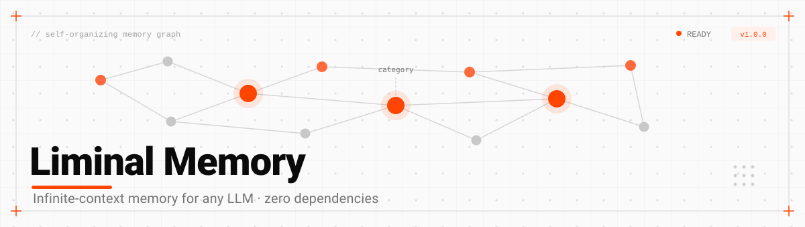

<p align="center">
  
</p>

[](https://github.com/Automacene/liminal-memory)
[](https://github.com/Automacene/liminal-memory)
[](./LICENSE)
[]()
[]()

## What is Liminal Memory?

A small library for deterministic recall over a pool of nodes.

Language models have two problems with long conversations. The obvious one is capacity: the
window fills and older material falls out. The less obvious one is that a bigger window does not
fix it, because the model still has to locate the relevant part on its own, softly and
unpredictably.

Liminal Memory takes the finding step out of the model. You keep your content as nodes in memory,
search them with ordinary relevance math, and hand the model only what matched. The same pool and
the same query return the same nodes every time, and you can point at the reason any node came
back.

It manages the lifecycle of those nodes and nothing else. Tagging, graph traversal, and the
content itself are yours to define, with a working default for each, so the simple case stays
simple.

## Install

```bash
npm install @automacene/liminal-memory
```

Or use it with no build step at all:

```html
<script src="https://unpkg.com/@automacene/liminal-memory"></script>
<script>
  const mem = new Liminal.LiminalMemory();
</script>
```

## Getting started

```js
import { LiminalMemory } from "@automacene/liminal-memory";

const mem = new LiminalMemory();

await mem.create({ content: "the quarterly report is due on friday" });
await mem.create({ content: "lunch with sam on tuesday" });

const hits = await mem.search("when is the report due");
// [{ id: "main-0f9c...", content: "the quarterly report is due on friday", ... }]
```

`search` gives you whole nodes, best first. Feed them to your model however you like: this
library never talks to one.

## The node

Every node has the same six fields. Three of them are yours to fill with anything.

```js
{
  id: "main-0f9c8b7a-...",   // unique across every pool
  pool: "main",              // which pool holds it
  content: "...",            // yours: a string, an object, a chunk, anything
  tags: { keywords: [...] }, // yours: whatever your tagger produces
  graph: { to: [], from: [] },  // yours: whatever your graph algorithm stores
  metadata: { createdAt: 0, updatedAt: 0 }  // ours, plus anything you add
}
```

`content` is the only required part, and it can be any type:

```js
await mem.create({ content: { user: "where is it", assistant: "on the desk" } });
await mem.create({ content: "a plain string" });
await mem.create({ content: null });  // structural: reachable by graph, never by search
```

Pass an `id` to name a node yourself. Reusing one throws rather than overwriting.

```js
await mem.create({ id: "system-prompt", content: "you are..." });
```

## Pools

Different kinds of node belong in different pools, because relevance scoring depends on
corpus-wide statistics. Mixing long conversation turns with short tool descriptions distorts the
ranking of both.

```js
await mem.pool("chat").create({ content: "do you remember the report" });
await mem.pool("docs").create({ content: "report template v2" });

await mem.pool("docs").search("report");  // only ever sees the docs pool
```

Ids are unique across every pool, so `mem.get(id)` finds a node wherever it lives and a graph
edge can point anywhere.

Scores from two pools are not comparable, since each is relative to its own pool's statistics. To
merge results, normalize each side first, usually by dividing by that pool's top score.

## Working memory

The pool is meant to hold what fits in memory. When you want older nodes out, `evict` hands them
to you on the way:

```js
const mem = new LiminalMemory({
  onEvict: async nodes => db.save(nodes)   // persist however you like
});

await mem.pool().evictOldest(100);
await mem.pool().evict(node => node.metadata.createdAt < cutoff);
```

`evict` waits for your hook before dropping anything. `remove` forgets without telling anyone.

## The graph

Edges are optional and never affect ranking. Search returns the same nodes whether or not any
edges exist.

Pass `from` to name the node asking the question. It gets left out of its own results, and
everything recalled gets linked back to it:

```js
const asking = await mem.create({ content: "do you remember the report" });
const hits = await mem.search("report", { from: asking.id });

mem.neighbors(asking.id);
// [{ id: "main-...", observedAt: 1737000000000, direction: "to" }]
```

That association is free, since those nodes are already being walked to return them.

An edge carries `observedAt`, the last time the connection was seen. Seeing it again moves the
time forward. An edge created without one never decays, which is what you want for fixed
structure such as one document chunk following the next:

```js
mem.link(chunkA, chunkB);          // permanent
mem.link(chunkA, chunkB, Date.now());  // decays unless seen again
```

Decay is off by default. Turn it on per pool:

```js
import { decayGraph } from "@automacene/liminal-memory";

const mem = new LiminalMemory({ graph: decayGraph({ decayMs: 7 * 24 * 60 * 60 * 1000 }) });
```

Decay is lazy: expired edges are dropped from nodes that something touches, not on a timer.

## Bring your own

Three pieces are swappable. Each has a default that works.

A **tagger** turns content into terms. `forNode` writes the tags bucket, `forQuery` turns a query
into terms, `termsOf` reads a bucket back out.

```js
const mem = new LiminalMemory({
  tagger: {
    forNode: async node => ({ embedding: await embed(node.content) }),
    termsOf: tags => tags.embedding ?? [],
    forQuery: async query => embed(query)
  }
});
```

An **engine** ranks ids against terms, with `add`, `remove`, `search`, and `clear`. Swap it
alongside the tagger, since an engine only understands the terms its tagger produces. Pass a
factory when you use more than one pool, because an engine holds one pool's index.

A **graph** handles edges, with `link`, `sweep`, and `neighbors`.

Anything that can call one of your hooks returns a promise, so `create`, `update`, `evict`,
`search`, and `rank` are async. Pure reads like `get`, `list`, and `size` are not.

## Saving and loading

```js
const snapshot = JSON.stringify(mem);
mem.load(JSON.parse(snapshot));
```

Ids, timestamps, tags, and edges all come back exactly as they were. A restored pool is
searchable with no rebuild step, since indexing happens lazily on the first query.

## API

**Container**: `pool(name)`, `pools()`, `hasPool`, `dropPool`, `get`, `has`, `size`, `link`,
`neighbors`, `toJSON`, `load`, `clear`, plus `create`, `createMany`, `update`, `list`, `search`,
and `rank` as shorthand for the default pool.

**Pool**: `create`, `createMany`, `update`, `evict`, `evictOldest`, `remove`, `clear`, `search`,
`rank`, `link`, `neighbors`, `get`, `has`, `list`, `ids`, `size`, `toJSON`, `load`.

**Also exported**: `Pool`, `BM25`, `keywordTagger`, `decayGraph`, `extractKeywords`,
`flattenToText`, `stem`, `createNode`, `patchNode`, `uuid`, `generateId`, `STOPWORDS`, and
`defaults`.

## License

Apache 2.0
